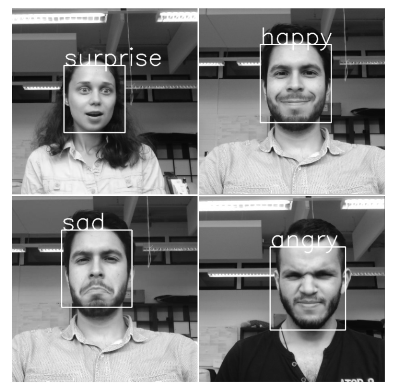
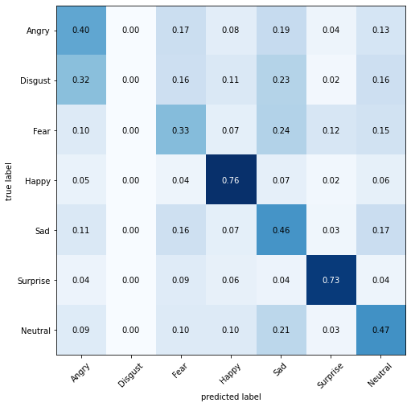
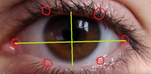
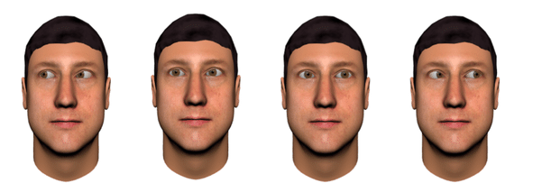

# Student-Engagement

## Environment setup

### Installing c++ tools for cmake
First install Visual Studio build tools from https://visualstudio.microsoft.com/thank-you-downloading-visual-studio/?sku=Community&rel=15#  
Then go to Individual Components. Search for "Visual C++ Tools for Cmake" (under the compilers) and install it.

### Creating environment
Create an anaconda environment with python version 3.7.3 and install required packages in requirements.txt  
To do so open an anaconda prompt and enter the following commands:  

    conda create -n SE_env python==3.7.3  
    conda activate SE_env  
    pip3 install -r requirements.txt

## Model input type
The model can take one input type out of 4 possible types:
* video file
* image sequence 
* image sequence with a network state file for each image
* live camera

### Video type
The model reads a video named "sample_video.mp4" in the project folder. If you want to test it on a sample video copy the video to the project folder and rename it "sample_video.mp4". The model automatically detects network problems by checking for blank images and checking for repeated frames.  

### Image sequence type
The model reads all images that exist on a folder named "sample_image_seq" in the project folder. This images should have arranged names (i.e. "1.png","2.png","3.png", ... ) according to their capture time so that the model can automatically test for repeated frames (network problem) .  

### Image sequence with network type
In addition to reading images from the"sample_image_seq" folder, the model reads data from a file named "NW_state.csv" that exists in the project folder. that csv file contains a TRUE or FALSE per each image in the "sample_image_seq" folder representing the network state (good network : TRUE). So instead of detecting null or repeated frames, in this case the model totally relies on the csv file for network problems.

### Live camera
The model uses the default camera of the device to capture a video. A window of the camera will show, when you need to stop capturing and get the result you should press 'q'.

## Adjusting input type
The default type is set to video. You can change the input type in the configuraion file "config.yaml" by setting: 

    input_type: <change_this_value>
possible values are 'video','image_seq','NW_image_seq','live_camera'.  

## Running the model
Run the main.py file to test the vision module on a sample video or image sequence. The model will ask for a name for the video or the image sequence to be tested. you can for example insert 'examples/small-distraction.mp4'. In case of live camera, please insert an name. The total engagement percentage result will be printed after processing all the frames along with the attendance. These results will also be saved in a file named results.csv having the name of the processed video / image folder name / live camera feed inserted name. Before you run the model, you need to make sure that the project environment is activated.  

    conda activate SE_env  
    python main.py

## Further adjustments
Inside the "config.yaml" file there are two more parameters that you can change:
* attendance_threshold : This value is the minimum engagement required for attendance. Here the value is 0.5 "50%", you can adjust this for your needs.
* happy_threshold : This value is the maximum percentage of the time allowed for the students to laugh or smile without having any negative impacts on engagement. Here it's set to 0.02 (2%). This means that for a lecture that lasts for 100 mins, students are allowed to laugh or smile for 2 mins without affecting their engagement.

## Results
The model was tested in 3 cases "good-attetion","small-distraction" and "large-distraction". These test cases exist in the examples folder. To reproduce the results, please copy one of the videos and paste it in the main project directory renamming them to "sample_video.mp4".  
<table>
  <tr>
    <td>File name</td><td>Engagement</td><td>Attendance</td>
  </tr>
  <tr> 
    <td>good-attetion.mp4</td> <td>88.71%</td> <td>Yes</td> 
  </tr>
  <tr>
    <td>small-distraction.mp4</td> <td>68.67%</td> <td>Yes</td> 
  </tr>
  <tr>
    <td>large-distraction.mp4</td> <td>15.69%</td> <td>No</td> 
  </tr>
</table>

## How the vision module works
The vision module predicts engagement percentage based on 3 measurements:
* Emotion
* Eye blinking
* Eye gaze direction

### Emotion
A deep learning emotion classifier was used to predict emotion of the student. The possible emotion predictions are: 'Angry', 'Disgust', 'Fear', 'Happy', 'Sad', 'Surprised', 'Neutral'. The emotion of an engaged student should remain neutral, however, sometimes the lecturer adds some allowable amount of humour to the content. taking this into consideration, an adjustable allowable duration percentage per the whole lecture for students to laugh is set "happy_threshold" so that engagement measurement is not affected by this allowable duration.  

  
Another thing is, the model sometimes misclassifies the Neutral state. We can see from the model error map that this mostly happens with angry, fear, happy and sad. To avoid these misclassifications, when the model predicts these classes (angry, fear, happy, sad) it checks if the Neutral class probability is low compared to the highest class (twice less than). If that wasn't true then this is most likely a misclassification, so it get's changed to neutral. This helps avoiding misclassifing an engaged student as distracted.

### Eye Blinking and gaze direction
Dlib is used to predict face land marks then eye land marks are extracted. For the Blinking part the module draws 2 perpendicular lines (as seen in the image) that represent eye opening. these lines are drawn using the 6 landmarks of the eye. A threshold is used for the ratio between the horizontal and verical line to detect if the person is blinking or not. 

After detecting eye land marks, the eye area can be extracted from the image and the ratio between the white area left to the iris and the one right to the iris is used to measure eye gaze direction. using 2 thresholds for this ratio, the eye of the student could be determined as looking out of the screen or not, hence decide engagement.

## Datasets and pretrained models
* Facial Expression Recognition Challenge : https://www.kaggle.com/c/challenges-in-representation-learning-facial-expression-recognition-challenge/data
* Pretrained emotion model : https://github.com/balram2697/Face-Emotion-Recognition/blob/master/models/emotion_models/model_resnet.102-0.66.hdf5
* Front face detector used in emotion model : https://github.com/balram2697/Face-Emotion-Recognition/blob/master/models/detection_models/haarcascade_frontalface_default.xml
* Dlib face landmarks: https://github.com/italojs/facial-landmarks-recognition/blob/master/shape_predictor_68_face_landmarks.dat  
  
## References
* Eye gaze and eye blinking modelling: https://pysource.com/2019/01/
* Emotion detection : https://github.com/balram2697/Face-Emotion-Recognition/blob/master/

